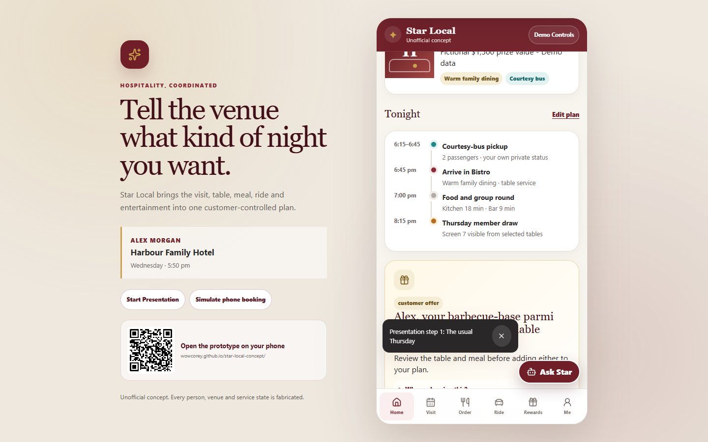

# Star Local Concept v0.2.1

**An independent, unofficial prototype for a customer-facing hospitality operating layer.**

Star Local coordinates the choices that shape a pub visit—venue zone, table, food, drinks, entertainment, courtesy transport, service and rewards—while keeping the customer in control and safety-sensitive decisions with venue staff.

> Tell the venue what kind of night you want.



_Every visible person, venue, layout, product, price, event, balance and service state is fabricated._

## Status and safety boundary

- This is a concept prototype, not a production product or an official Star Group service.
- It has no backend and makes no live AI, phone, POS, booking, payment, transport, location, gaming or venue-system calls.
- Alcohol and serious-allergy flows visibly require human review. The prototype never supplies alcohol or claims an RSA decision.
- It contains no real customer, employee, venue, route, security, exclusion, payment or gaming data.
- Gaming-machine reservation, cashless gaming, gambling marketing and gaming controls are intentionally excluded.

## What v0.2 demonstrates

- Meaningfully different Bistro, Sports Bar, Public Bar, Outdoor and Function zones
- Zone-aware table maps, customer filters, access attributes and eight event-layout presets
- **Watch Tonight** schedules with locked, scheduled and requestable screens, table sightlines and local phone-audio simulation
- Separate food and drinks experiences, staff-controlled drink review, identified group rounds and combined order status
- Persistent **Table Service** requests routed to a venue function rather than a fabricated employee
- A visit-stage-aware Home screen and venue-local Tonight timeline
- Structured **Ask Star** workflows that can coordinate multiple deterministic actions
- A disclosed simulated telephone receptionist that writes into the same visit plan and transfers serious-allergy questions to a human
- Controllable marketing explanations, expanded rewards, receipts and customer-managed memory
- Customer-initiated bottle-shop collection with collection-counter age confirmation
- A 16-step guided presentation mode and a locally rendered QR link to the public prototype

## Synthetic meeting journeys

- **Alex Morgan / Harbour Family Hotel** — family Bistro visit, Table 23, barbecue-base parmigiana, Cowboys viewing, courtesy transport and member draw
- **Jordan Lee / Northside Sports Hotel** — Sports Bar, UFC main card, event screens and participant-controlled group round
- **Taylor Smith / Hinterland Local** — low table, step-free route, accessible transport, community trivia and bottle-shop collection

Use **Demo Controls** to load a journey or tune the simulated day, time, layout, booking, order, service, screen, transport, marketing, rewards, phone and collection states. **Reset demo** restores the v0.2.1 flagship defaults.

## Local setup

Requirements: Node.js 22.12 or newer. CI and Pages deployment use Node.js 24.

```bash
npm ci
npm run dev
```

Vite prints the local URL. Runtime state persists under the versioned browser key `star-local-demo-v1`; earlier state is migrated to the v0.2.1 schema with safe defaults.

To clear v0.2 state, use **Demo Controls → Reset demo**, or run this in the browser console and reload:

```js
localStorage.removeItem("star-local-demo-v1");
location.reload();
```

## Commands

```bash
npm run dev          # development server
npm run build        # strict TypeScript build and Vite production bundle
npm run preview      # production preview
npm run format       # write Prettier formatting
npm run format:check # check formatting
npm run lint         # ESLint
npm run typecheck    # strict TypeScript checks
npm run test         # Vitest unit and component tests
npm run test:e2e     # Playwright mobile and desktop journeys
npm audit            # dependency advisory report
```

For the first browser-test run, install Chromium with `npx playwright install chromium`.

## Architecture at a glance

```text
React presentation shell
  → GitHub Pages-safe HashRouter and lazy route chunks
  → typed page and feature modules
  → Zustand transitions and v0.1 → v0.2 persistence migration
  → deterministic fixture repository
  → synthetic TypeScript fixture domains
```

There is no runtime network dependency. `qrcode.react` renders the public prototype link as a local SVG; Lucide provides local vector icons. See [Architecture](docs/ARCHITECTURE.md) and [Fixture data](docs/FIXTURE_DATA.md).

## GitHub Pages deployment

`vite.config.ts` retains the production base `/star-local-concept/`. `.github/workflows/deploy-pages.yml` runs `npm ci`, Vitest and the production build on `main`, uploads `dist`, then deploys through GitHub Pages.

Public URL: <https://wowcorey.github.io/star-local-concept/>

Repository administrators only need **Settings → Pages → Build and deployment → Source → GitHub Actions** if that source is not already selected. No secrets or environment variables are required.

## Documentation

- [v0.2 changelog](docs/V0_2_CHANGELOG.md)
- [Architecture](docs/ARCHITECTURE.md)
- [Presentation guide](docs/PRESENTATION_GUIDE.md)
- [Meeting demo guide](docs/DEMO_GUIDE.md)
- [Zone and screen model](docs/ZONE_AND_SCREEN_MODEL.md)
- [Drink and RSA prototype](docs/DRINK_AND_RSA_PROTOTYPE.md)
- [Fixture data](docs/FIXTURE_DATA.md)
- [Accessibility](docs/ACCESSIBILITY.md)
- [Security and privacy](docs/SECURITY_AND_PRIVACY.md)
- [Public data and asset rules](docs/PUBLIC_DATA_AND_ASSET_RULES.md)

## Known limitations

- All outcomes, timing, waveform motion and transcripts are deterministic simulations.
- The assistant is a scripted intent catalogue, not a language model.
- Floor plans are original simplified geometry, not operational venue maps.
- Payments, supply, collection, calls, check-in, rewards, draws and transport never leave the browser.
- Production integrations, consent records, authentication, staff tooling, analytics and a venue-layout editor are excluded.
- A future regulated gaming module may be discussed in documentation only; it is not implemented here.

Do not commit the private design PDF, its embedded screenshots, real venue imagery or extracted company assets. The repository contains only the new synthetic implementation and original presentation captures.
