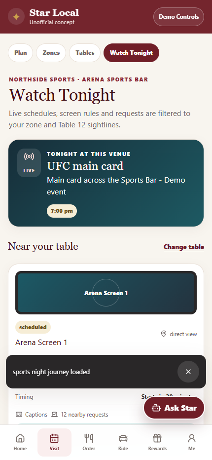

# Zone and screen model

## Zone intelligence

A venue zone is a customer-facing hospitality area, not merely a map label. Each synthetic zone declares:

- atmosphere and noise character;
- access summary and customer-safe facilities;
- table types and party-size fit;
- food/drink service model;
- entertainment and event context;
- demand state and short explanation;
- linked screen IDs; and
- whether it is customer selectable.

Selecting a zone immediately changes the available tables. The floor plan then combines the stable venue layout with the active event preset and customer filters. Presets can move, hide or join tables; they do not expose live occupancy or staff notes.

## Table model

Tables carry normalised original geometry, capacity, zone, table type, atmosphere, accessibility flags, customer tags and screen sightline IDs. A sightline is a curated prototype assertion—not computer vision, precise measurement or an operational guarantee.

The map and accessible list are equivalent controls. Each table's accessible label includes its number, capacity, zone, type, atmosphere, step-free state, screen visibility and current match state.

## Screen rules

Each screen belongs to one venue zone and has one control rule:

- **Locked** — required venue content; customers cannot override it.
- **Scheduled** — the published synthetic programme is visible and fixed for the slot.
- **Requestable** — a customer may join or create a local request; the venue retains final control.

Schedules reference a screen and event/time slot. The Watch Tonight page intersects the selected zone and table sightlines with the venue's screens, so a customer can distinguish what is on, what can change and what their table can plausibly see.

## Phone audio

Where the venue fixture enables it, a visible screen can expose local phone audio. Play/pause and volume change only the deterministic UI waveform. No broadcast audio, microphone, Bluetooth, streaming, rights management or network connection is implemented.

## Exclusions

The model does not include surveillance, facial recognition, staff notes, live occupancy, real venue layouts, gaming areas, regulated content controls or precise customer location.
